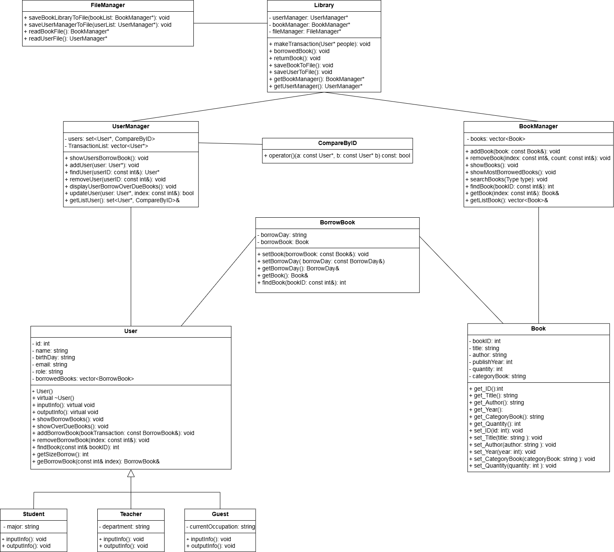
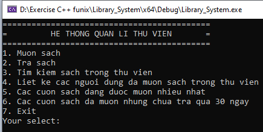
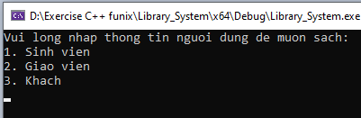
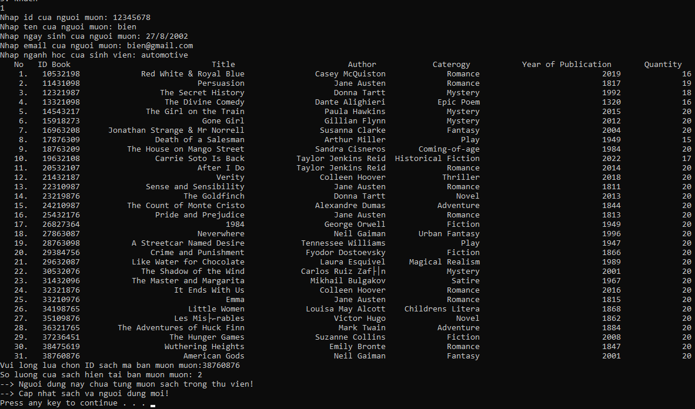
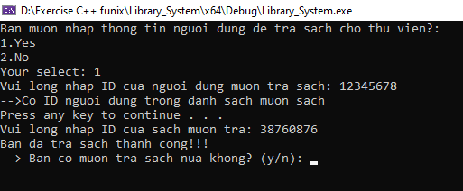
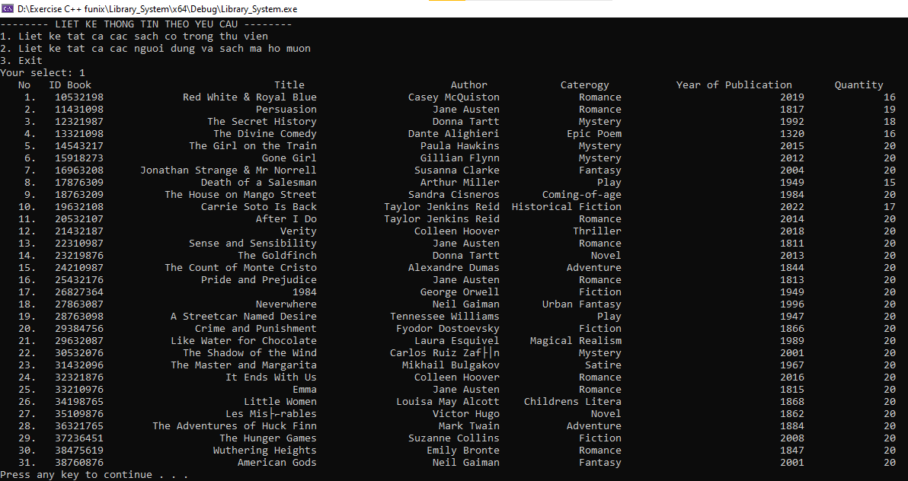
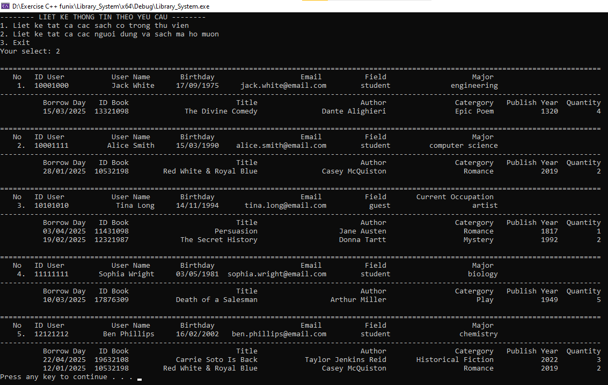
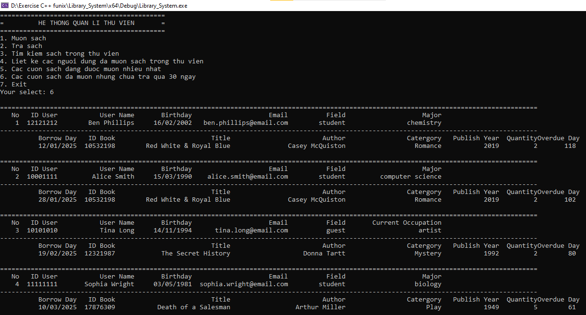

# PROJECT: HỆ THỐNG THƯ VIỆN QUẢN LÍ DANH SÁCH NGƯỜI DÙNG VÀ QUẢN LÍ SÁCH 

- Project này sẽ bao gồm quản lí thông tin người dùng trong thư viện khi họ mượn sách và quản lí các thông tin của 
các đầu sách có trong thư viện.

### Thông tin về source code:

- Viết bằng ngôn ngữ C++ 
- Build trên Visual Studio IDE 2022.

### Project bao gồm các kiến thức đã sử dụng như:

- Nhập xuất dữ liệu
- Hàm, tham trị, tham chiếu
- Sử dụng thuật toán tìm kiếm nhị phân cho mảng lưu trữ các sách trong thư viện
- STL container: vector và set
- Sử dụng kế thừa và đa hình trong OOP
- Sử dụng regex để kiểm tra việc nhập dữ liệu có hợp lệ hay không hợp lệ
- Kiểm soát ngoại lệ (exception handling) cho thao tác đọc ghi file.

## Cấu trúc hệ thống có:

## Chức năng của chương trình:

- Mượn sách
- Trả sách
- Tìm kiếm sách theo tên sách, tên tác giả và thể loại sách
- Liệt kê:
  - Các thông tin người dùng và sách mà họ mượn
  - Các sách có trong thư viện
- Báo cáo các cuốn sách mượn nhiều nhất
- Báo cáo các cuốn sách đã mượn nhưng chưa trả quá 30 ngày

### Chức năng mượn sách: 
- Khi mượn sách, chọn loại chức vụ của user

- Sau đó, điền ID riêng của người dùng vào để mượn sách. Sách mà họ mượn cũng có ID riêng.
- ID riêng của người dùng dùng để kiểm tra họ đã từng mượn sách hay chưa và nếu họ mượn lần tiếp theo thì lưu thông tin sách vào thông tin người mượn đó.

### Chức năng trả sách: 
- Khi trả sách, nhập ID người dùng và ID book mà sách muốn trả
- Khi người dùng trả hết sách thì tương đương với việc xóa thông tin người dùng ra khỏi thư viện

### Chức năng tìm kiếm: 
- Cài đặt thuật toán tìm kiếm phần tử bằng thuật toán tìm kiếm nhị phân để tìm kiếm thông tin sách trong thư viện

### Liệt kê: 
- Các sách có trong thư viện

- Các thông tin người dùng và sách mà họ mượn

### Chức năng báo cáo các cuốn sách được mượn nhưng chưa trả quá 30 ngày:
- Sách mà người dùng đã mượn đã lưu ngày mà họ mượn khi họ đăng nhập vào thư viện lúc trước.
- Khi nhập ngày tháng hiện tại, thư viện sẽ hiển thị các sách mà người mượn đã mượn quá 30 ngày.

